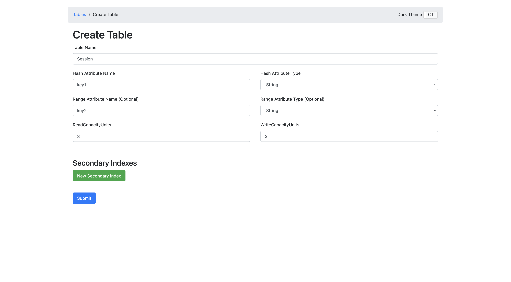
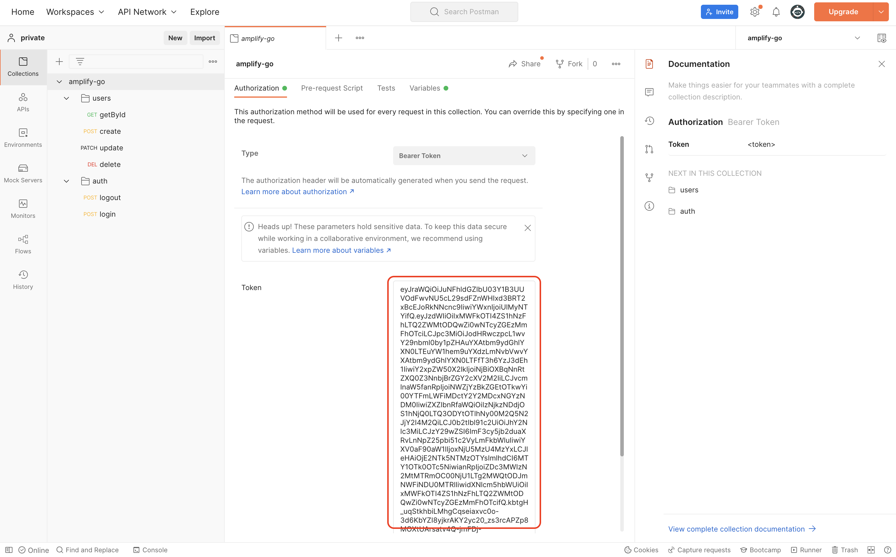

## 環境構築

- Docker でデータベースを起動

  - postgres
  - dynamodb
  - dynamodb admin

    ```
    cd api
    docker compose up
    ```

- ローカルでバックエンドを起動

  ```
  amplify-go % go version
  go version go1.18.1 darwin/arm64
  ```

  ```
  cd api
  go run main.go
  ```

- 初回のみ DynamoDB のテーブルを手動で作成

  http://0.0.0.0:8001/

  

- Postman に`amplify-go.postman_collection.json`を import してローカル API にリクエストできれば環境構築は完了

  - Cognito のアクセストークンを設定する必要あり（アクセストークンはフロントエンドを起動して localstorage から取得可能）

    
